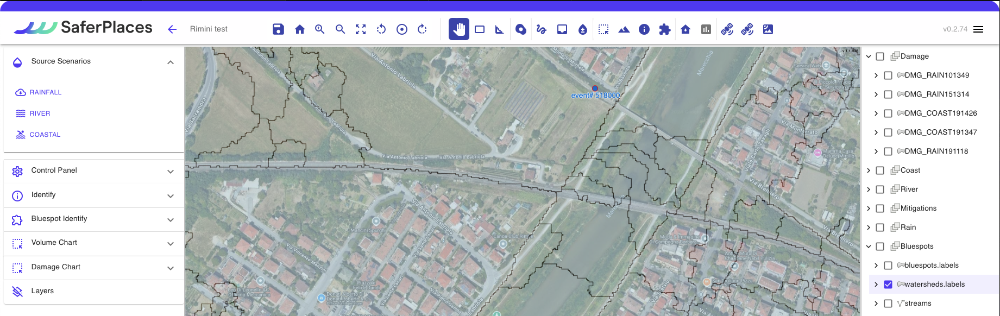
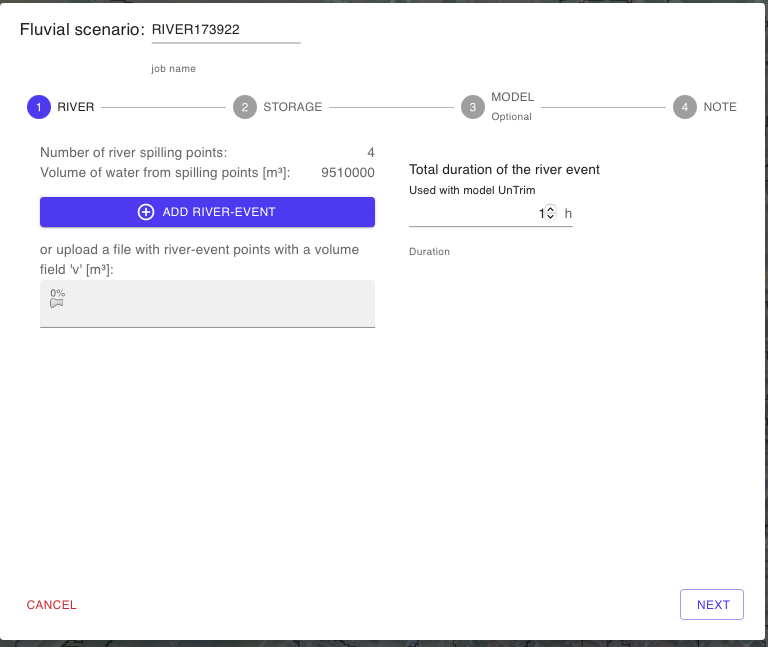
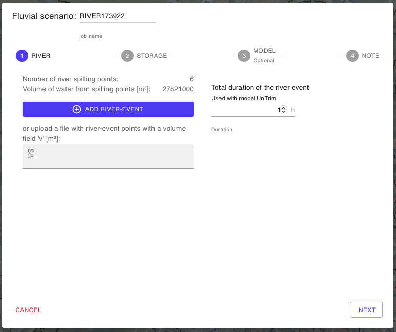
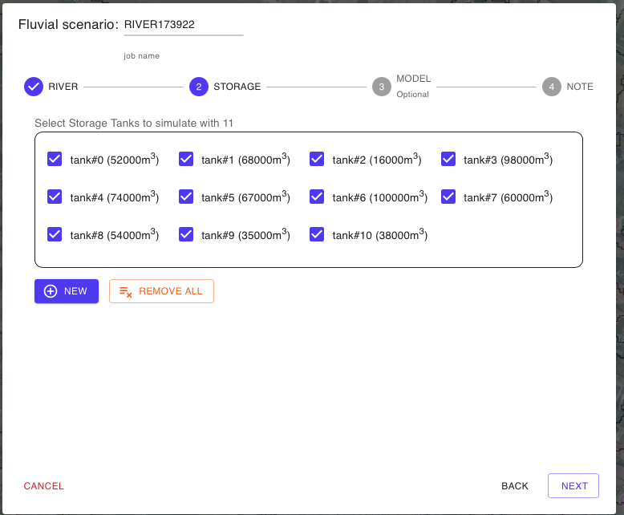
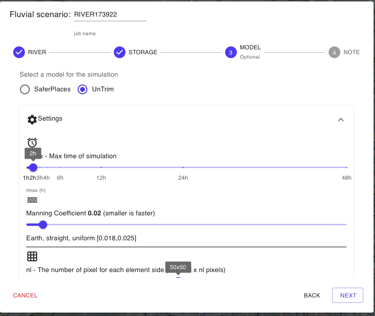
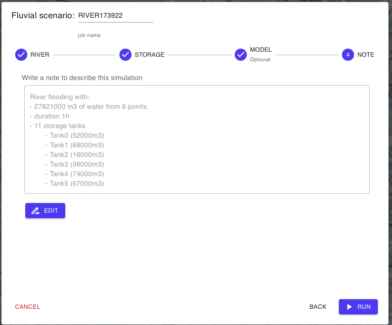
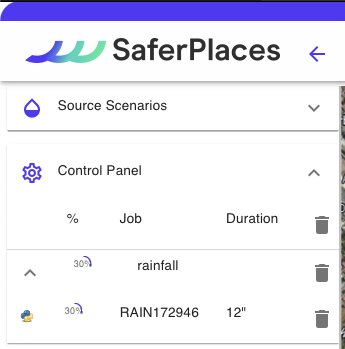

# 💦 Fluvial Flood Simulation

In the "Fluvial Scenario" section, users can define and generate a river flooding scenario. This may result from a volumetric release, embankment breach, or overtopping, with water flowing out over a specific period of time.

Releases are identified as Point Sources and can be user-defined by placing them along the banks of the river section under simulation.


When locating volumetric release sources, it is crucial to avoid placing the source point within the sub-basin of the watercourse. Doing so will ensure that the volumetric release only affects the river's course without causing downstream flooding.

To accurately pinpoint the release point, activate the watershed.labels layer within the "Bluespots" group.

This layer divides the computational domain into hydrological sub-basins and helps determine which basin will be affected by the volumetric release causing floods.


<figure><figcaption></figcaption></figure>

## RIVER: - RIVER FLOOD SIMULATION

The Wizard process consists of the following steps:

Simulation Name

The user can change the name automatically assigned to the simulation. It is recommended to use standard characters and numbers without spaces or symbols.

Definition and Characterization of the Fluvial Event: "Fluvial Scenario" (1-RIVER)

The first step in 1-RIVER involves identifying and characterizing the location, intensity, and duration of the fluvial release event to be simulated.

Users can generate and locate multiple fluvial release events, determined by Breach or Overtopping of Levees, using the "ADD RIVER EVENT" button.

After clicking the button, the River Tool is activated, allowing users to define fluvial release points on the map.

Once activated, the River Tool allows users to define fluvial release points on the map:

* **NEW**: Adds a new point and allows users to specify the water volume for a point release.
* **DELETE**: Removes a single release point.
* **CLEAR**: Removes all release points.

After adding all fluvial release points within the calculation domain, clicking on "BACK TO THE WIZARD" returns users to a summary window. This window shows the total number of defined points (representing potential breaches or overtoppings) and the total volume released over the domain area.

Users must define the **Total Duration of the Fluvial Event** for all generated points, used in the UNTRIM hydrodynamic model. The duration is defined in hours (h) and applies uniformly to all defined release points. It is not permitted to define specific durations for individual release points.

Storage Tanks (2-STORAGE)

On the SaferPlaces platform, as a risk mitigation measure, it is possible to add Storage Tanks in the calculation domain. These tanks help reduce the water volume flooding a specific area or sub-basin during the simulation.

Storage Tanks can be positioned as point elements using the "_Draw storage tank_" tool, available both in the Wizard and in the panel.

To create a Storage Tank, click on "NEW". This allows you to place the tanks and assign each one a volumetric capacity in m³.

In the "Select Storage Tanks to simulate" box, the user can select or remove the existing Storage Tanks. With "REMOVE ALL", all selected tanks are deselected.

CALCULATION MODEL  (3-MODEL)

In this section of the Wizard, the user can:

1. Select the Flooding Model (Hazard)
2. Activate the calculation of Economic Damage

The available pluvial flooding models are:

[safer\_rain.md](../flood-hazard-models-saferplaces/safer_rain.md "mention") - Raster-based filling and spilling modelng

[untrim.md](../flood-hazard-models-saferplaces/untrim.md "mention") - Raster-based filling and spilling model

The default option is always the model [safer\_rain.md](../flood-hazard-models-saferplaces/safer_rain.md "mention")

If the model  [untrim.md](../flood-hazard-models-saferplaces/untrim.md "mention") is selected, the following "Settings" parameters need to be defined by clicking on the dedicated task:

* Slider - Simulation Duration in hours (h) - Tmax - Max time of simulation
* Slider - Manning's Roughness Coefficient - Manning Coefficient
* Slider - Calculation cell by number of pixels - nl - The number of pixels for each element side
* Slider - Numerical integration time (min) - Delta T - Time simulation step
* Slider - Output Print Frequency (min) - Ti - Time shoot interval

To activate the economic damage calculation model, check the "Apply Damage" checkbox.

Definition of the parameters of the calculation m

**SaferPlaces Model:** For the SaferPlaces calculation model, no additional parameters are needed.&#x20;

**UNTRIM Model:** If the UNTRIM hydrodynamic model is chosen, it is essential to specify various simulation parameters using sliders:

* **Simulation Duration (hours):** Select a duration equal to or greater than the rain event; for example, if the rain lasts 2 hours, the simulation must be at least 2 hours.
* **Manning's Coefficient (dimensionless):** A uniform friction coefficient assumed in the calculation domain. Recommended value: 0.2.
* **nl (m):** Cell size defined by the number of pixels in meters. For example, selecting 50 with a 2 m Lidar resolution results in a 100 m cell. For Lidar resolutions of 1-2 m, values between 20 and 50 are recommended. The cell size affects the total number of cells, which in turn impacts the computation time. Keeping cells below 20,000 is advised for manageable computing times (3 minutes for each hour of simulation).
* **Delta T - Numeric Integration Step (sec):** A 6-second integration step is recommended.
* **Ti - Time Interval for Outputs (min):** Define the interval for output generation.

Activation Calculation of economic damage - DAMAGE

In the "Model" section of the wizard, you can activate the economic damage calculation for each building entered.\
\
The calculation of the economic damage is initially carried out with the following assumptions:

1. All buildings are considered residential, using a residential vulnerability curve.
2. Value of the building set at 1000 euros/sqm.

 

Insertion of metadata and description of the generated simulation (4- NOTE)

By clicking on the EDIT button, the user can activate a text box where he can enter metadata and descriptive details of the simulation he has just created.

 

RUN Simulation

By clicking on the RUN button, the user activates the execution of the created simulation.\
After launching, the Control Panel will display the execution of the process with the progress.

 

## Video Insertion River Release Points



## Video Insertion Accumulation Tanks



## Example of river simulation with SAFER model



## Example of river simulation with UNTRIM model

@inserire video
