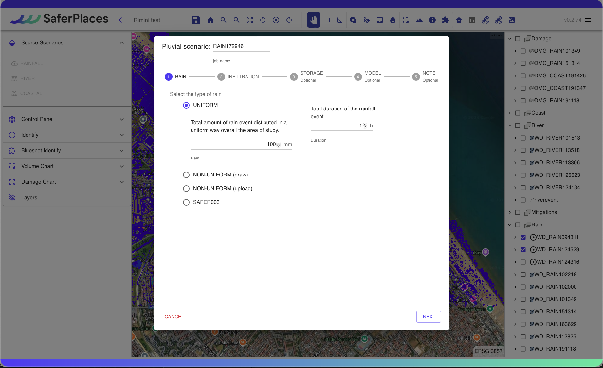
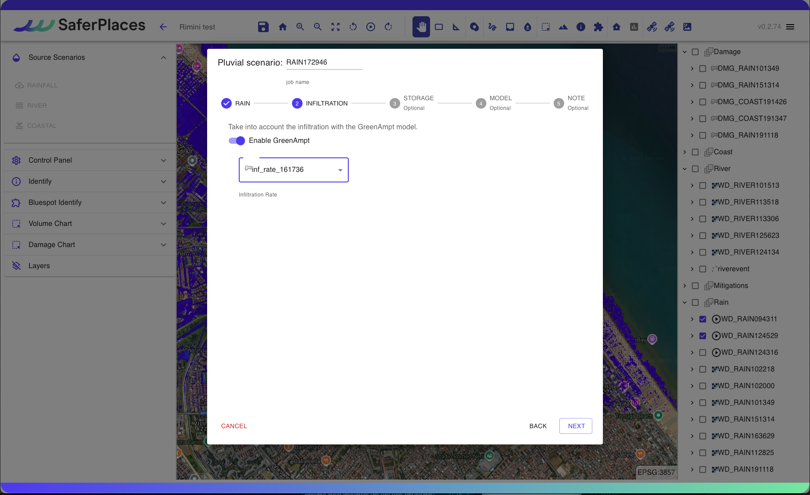
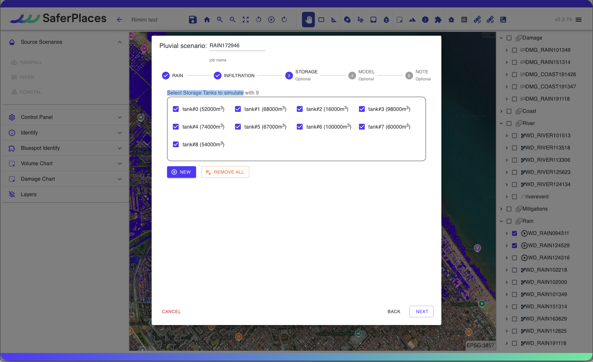
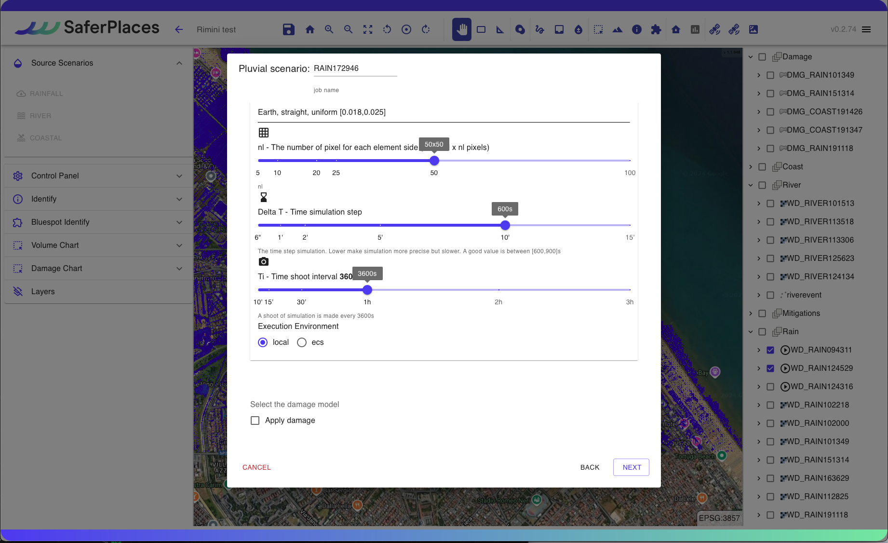

# 🌧️ Pluvial Flood Simulation

#### Procedure for Simulating Rain-Induced Flooding

This section describes the process for conducting a simulation of pluvial flooding, caused by intense and short-lived rainfall events. Such events create critical issues in managing the surface water runoff, leading to particularly severe flooding in low-lying urban areas, such as underpasses.

## RAINFALL - SIMULAZIONE ALLAGAMENTO PLUVIALE

The Wizard provides a guided procedure where the user defines the following input data

Simulation Name

The user can modify the automatically assigned name of the simulation. It is recommended to use standard characters and numbers without spaces or symbols.

Definition and characterization of the Rainy Event - "Pluvial scenario" (1-RAIN)

The first step, 1-RAIN, involves defining and characterizing the simulated rain event in terms of intensity and duration.

The user can define rain intensity in mm in three different ways:

1. **Uniform across the entire activated domain area**: Constant intensity (mm) across the entire area.
2. **Localized in a sub-area with non-uniform intensity (drawing)**: Variable intensity associated with a polygon drawn by the user using the “_Rain_” tool available in the
3. **Non-uniform (upload)**: Variable intensity by uploading a raster file in GeoTIFF format, for example from a RADAR METEO product or WEATHER FORECAST MODEL.
4. **Generated from a satellite product**: Intensity (mm)

The user can define the duration of the rain event in hours (h) through the box "Total duration of the rainfall event".

Soil infiltration model (2-INFILTRATION)

Users can activate the ground infiltration module while performing the simulation.

The Infiltration Module is based on the Green-Ampt Model and uses input data from the layers defined in the [step-3-infiltration-rate-raster-geotiff.md](../../digital-twin-and-activation-new-project/creation-of-digital-twin-and-activation-of-the-service-in-the-area-of-interest/step-3-infiltration-rate-raster-geotiff.md "mention") e [step-4-lithology-raster-geotiff.md](../../digital-twin-and-activation-new-project/creation-of-digital-twin-and-activation-of-the-service-in-the-area-of-interest/step-4-lithology-raster-geotiff.md "mention")

Storage Tanks (3-STORAGE)

On the SaferPlaces platform, as a risk mitigation measure, Storage Tanks can be added within the calculation domain. These tanks help reduce the volume of water flooding a specific area or sub-basin during simulations.

Storage Tanks can be placed as point elements using the "_Draw storage tank_" tool, available in both the Wizard and the panel.

To generate a Storage Tank, click "NEW". This allows you to position the tanks and assign each one a volumetric capacity in m³.

In the "Select Storage Tanks to simulate" section, users can select or remove existing Storage Tanks. By clicking "REMOVE ALL", all selected tanks will be deselected.

Calculation model (4-MODEL)

In this section of the Wizard, the user can:

1. Select the Flooding Model (Hazard)
2. Activate the calculation of Economic Damage

The available pluvial flooding models are:

[safer\_rain.md](../flood-hazard-models-saferplaces/safer_rain.md "mention") - Raster-based filling and spilling modelng

[untrim.md](../flood-hazard-models-saferplaces/untrim.md "mention") - Raster-based filling and spilling model

The default option is always the model [safer\_rain.md](../flood-hazard-models-saferplaces/safer_rain.md "mention")

If the model  [untrim.md](../flood-hazard-models-saferplaces/untrim.md "mention") is selected, the following "Settings" parameters need to be defined by clicking on the dedicated task:

* Slider - Simulation Duration in hours (h) - Tmax - Max time of simulation
* Slider - Manning's Roughness Coefficient - Manning Coefficient
* Slider - Calculation cell by number of pixels - nl - The number of pixels for each element side
* Slider - Numerical integration time (min) - Delta T - Time simulation step
* Slider - Output Print Frequency (min) - Ti - Time shoot interval

To activate the economic damage calculation model, check the "Apply Damage" checkbox.

Definition of the parameters of the calculation model

**SaferPlaces Model:** For the SaferPlaces calculation model, no additional parameters are needed.  

**UNTRIM Model:** If the UNTRIM hydrodynamic model is chosen, it is essential to specify various simulation parameters using sliders:

* **Simulation Duration (hours):** Select a duration equal to or greater than the rain event; for example, if the rain lasts 2 hours, the simulation must be at least 2 hours.
* **Manning's Coefficient (dimensionless):** A uniform friction coefficient assumed in the calculation domain. Recommended value: 0.2.
* **nl (m):** Cell size defined by the number of pixels in meters. For example, selecting 50 with a 2 m Lidar resolution results in a 100 m cell. For Lidar resolutions of 1-2 m, values between 20 and 50 are recommended. The cell size affects the total number of cells, which in turn impacts the computation time. Keeping cells below 20,000 is advised for manageable computing times (3 minutes for each hour of simulation).
* **Delta T - Numeric Integration Step (sec):** A 6-second integration step is recommended.
* **Ti - Time Interval for Outputs (min):** Define the interval for output generation.

.png>)

.png>)

Activation Calculation of economic damage - DAMAGE

In the "Model" section of the wizard, you can activate the economic damage calculation for each building entered.\
\
The calculation of the economic damage is initially carried out with the following assumptions:

1. All buildings are considered residential, using a residential vulnerability curve.
2. Value of the building set at 1000 euros/sqm.

Insertion of metadata and description of the generated simulation (5- NOTE)

By clicking on the EDIT button, the user can activate a text box where he can enter metadata and descriptive details of the simulation he has just created.

RUN SIMULATION

By clicking on the RUN button, the user activates the execution of the created simulation.\
After launching, the Control Panel will display the execution of the process with the progress.

## Esempio di simulazione pluviale pioggia uniforme con SAFER



## Esempio di simulazione pluviale pioggia non uniforme con SAFER



## Esempio di simulazione pluviale con Storage Tank



## Esempio di simulazione pluviale con Modifica Infiltrazione



## #Esempio di simulazione pluviale - Modello UNTRIM

@video da inserie

