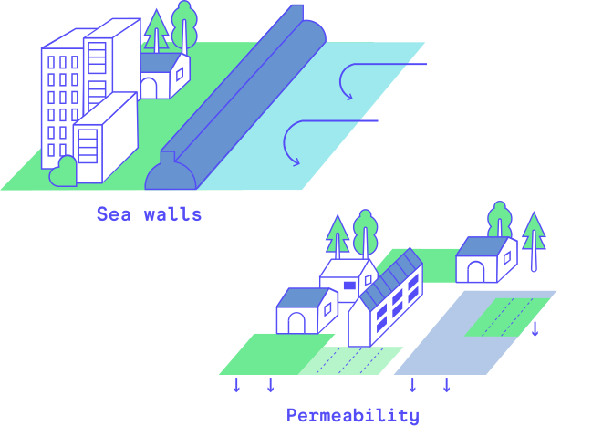
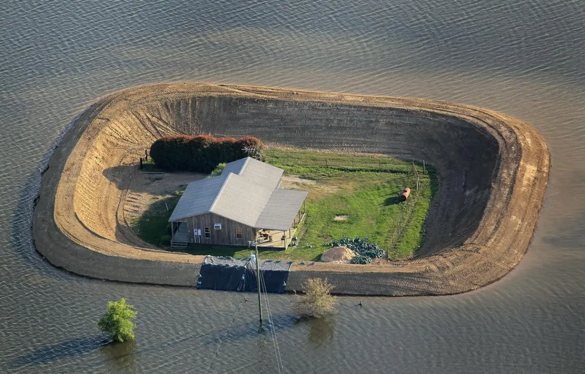
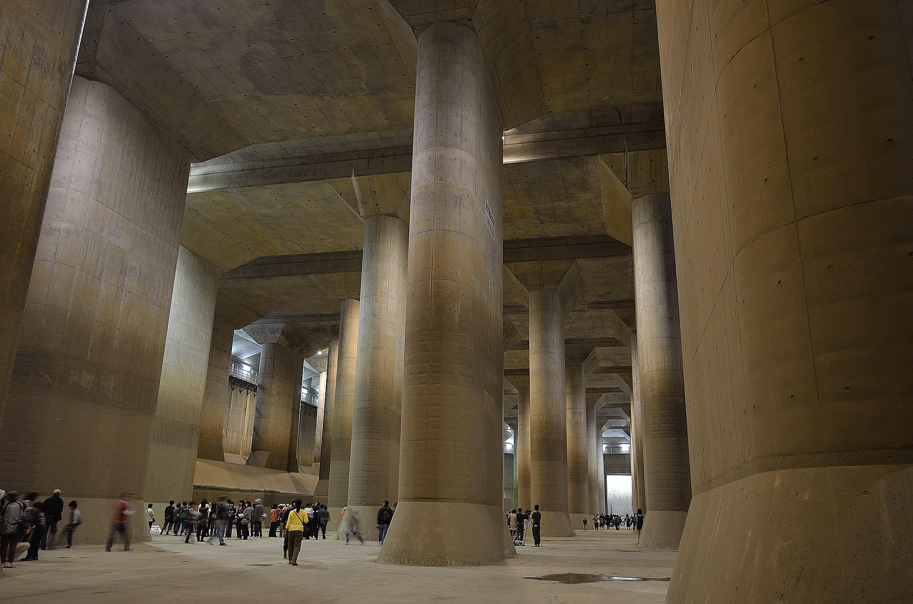

# 📔 Flood risk mitigation measures

Saferplaces can be used to test the effectiveness of projects and risk mitigation measures for flooding both in terms of reducing the hazard, such as the extent and magnitude (water depth), and in terms of passive protections and reducing the vulnerability of exposed assets.

<figure><figcaption></figcaption></figure>

Le misure di mitigazione che si possono simulare sono:

* [#physical-barriers](flood-risk-mitigation-measures.md#physical-barriers "mention"): Dikes, dunes, embankments, or walls that can contain and limit the extent of floods, particularly those of fluvial and coastal origin.
* [#storage-tanks](flood-risk-mitigation-measures.md#storage-tanks "mention") or water storage tanks capable of reducing the volume of water that floods a sub
* [#sustainable-urban-drainage-systems-suds](flood-risk-mitigation-measures.md#sustainable-urban-drainage-systems-suds "mention")Such as green areas, infiltration basins, permeable land use, green roofs, urban wetlands.

Physical Barriers

Physical barriers such as dunes, embankments, or walls can contain and limit spatial extent and reduce water levels associated with flooding scenarios.

Physical barriers can be added to the calculation domain with the tool "_**Draw barrier**_"  located in the [top-bar.md](../saferplaces-gui-web/top-bar.md "mention") which allows you to draw linear elements (polylines) and define a height in meters.

The edited physical barriers are simulated by modifying the elevation of the DTM, thus determining a containment effect on flooding phenomena.

The effect is particularly evident in coastal flood simulations, where continuous barriers like artificial dunes, if applied along the shoreline, can protect a significant portion of the hinterland.

Storage Tanks

Storage tanks are an effective mitigation measure for pluvial and fluvial flooding scenarios.

These involve incorporating storage tanks of a point-like type with an assigned volumetric capacity within their respective sub-basin into the calculation domain.

The effect achieved is the reduction of water accumulation in depressions, thereby mitigating the impacts of flooding.

LUsing the "_Draw storage tank_" tool,  **in the** [top-bar.md](../saferplaces-gui-web/top-bar.md "mention")the user can draw and locate storage tanks within the domain, represented as point elements.

Measures like "Storage Tanks" can be simulated to reduce the volume of water flowing over the surface and are particularly relevant for simulating pluvial flooding.

Sustainable urban drainage systems (SUDS)

Another effective measure for reducing flooded areas is the ability to modify both the surface runoff of water and the capacity of the soil to infiltrate and store water underground.

These are small, widespread measures such as green roofs, permeable surface design, and infiltration systems.

These measures are applied in urban areas with the primary aim of reducing the risk of intense and short-duration pluvial flooding.

The Saferplaces platform allows simulation of these measures by modifying the infiltration rate tool using  [step-3-infiltration-rate-raster-geotiff.md](../digital-twin-and-activation-new-project/creation-of-digital-twin-and-activation-of-the-service-in-the-area-of-interest/step-3-infiltration-rate-raster-geotiff.md "mention")  with the tool **"**_**infiltration rate**_**" located in the** [top-bar.md](../saferplaces-gui-web/top-bar.md "mention")

