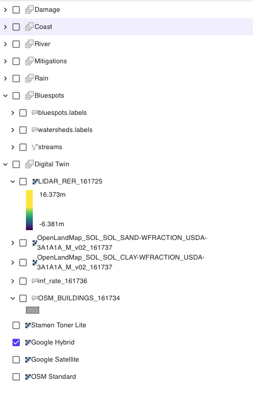
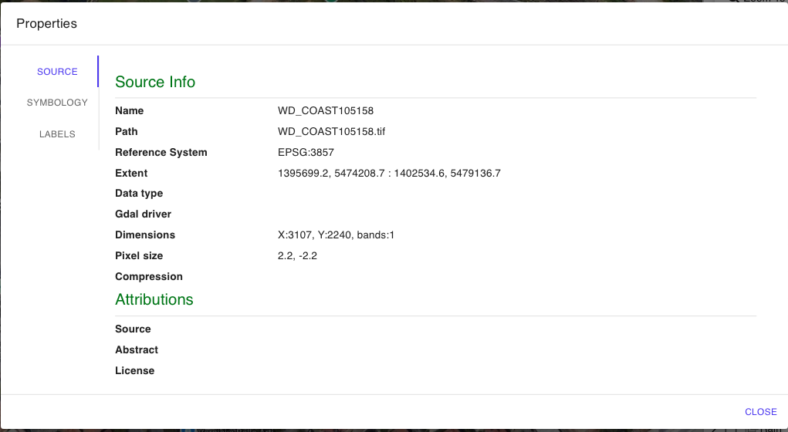
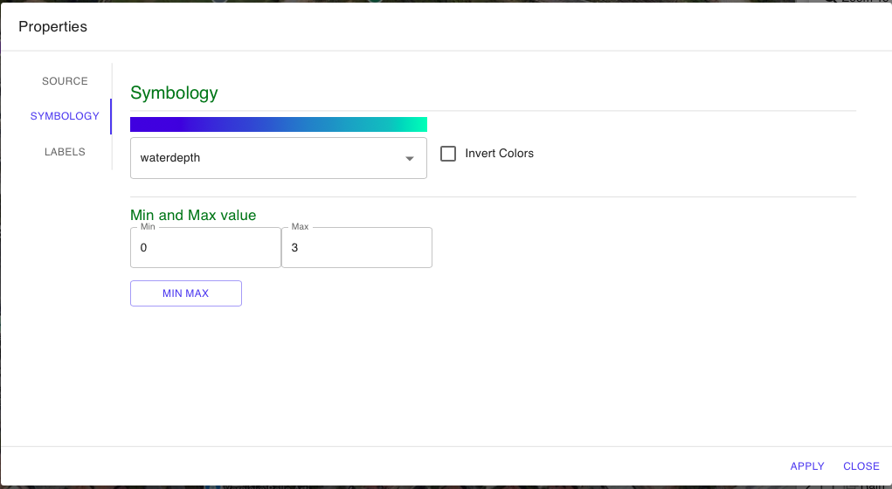
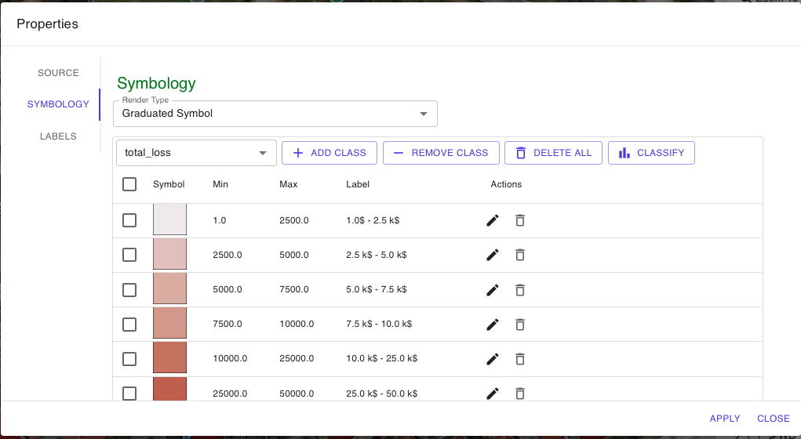

# Right sidebar

On the right side of the main screen, you will find a panel that lists all the geospatial layers ("layers") used for the activation of and the layers related to the results of the .

The geospatial layers of the project are organized into the following groups of layers

* DAMAGE - gruppo di layers dei risultati delle simulazioni di [damage-assessment-model-safer\_damage.md](../flood-and-damage-simulation/damage-assessment-model-safer_damage.md "mention")
* COAST - Group of layers of the results of the simulations of [coastal-flood-simulation.md](../flood-and-damage-simulation/source-scenarios/coastal-flood-simulation.md "mention")
* RIVER - Group of layers of the results of the simulations of [fluvial-flood-simulation.md](../flood-and-damage-simulation/source-scenarios/fluvial-flood-simulation.md "mention")
* RAIN - Group of layers of the results of the simulations of [pluvial-flood-simulation.md](../flood-and-damage-simulation/source-scenarios/pluvial-flood-simulation.md "mention")
* Digital Twin - Group of layers used and/or loaded in phase of [creation-of-digital-twin-and-activation-of-the-service-in-the-area-of-interest](../digital-twin-and-activation-new-project/creation-of-digital-twin-and-activation-of-the-service-in-the-area-of-interest/ "mention")
  * layer DTM&#x20;
  * Layers of lithological weaving class (Sand e Clay)
  * Infiltration layer obtained by reclassifying land use
  * layer building foot print - OSM Or uploaded by user
* Bluespots -Layer group that contains the shapefile vectors of:
  * bluespots.labels - Vector of the depressions of the sub-basins (watersheds.labels)
  * stream -Veottorial of the "streams" or flow lines that hydrologically connect the different "Bluespots"
  * watersheds.labels - Vector of hydrological sub-basins
* Layer  Background Maps
  * Google Map Hybrid or satellite
  * OSM
  * Stamen

<figure><figcaption></figcaption></figure>

By right-clicking on each layer or related group, the user can activate some useful functions listed in the figure.

<figure><figcaption>
Funzioni layer barra destra
</figcaption></figure>

In particular, it is

* EXPAND ALL &#x20;
* COLLAPS ALL
* ZOOM TO LAYER&#x20;
* OPACITY&#x20;
* REMOVE LAYER
* EXPORT - save the layer to a file (Geotiff or Shapefile)
* UP/DOWN - move its position up/down
* PROPERTIES - inspect and modify its properties.

By enabling the PROPERTIES on the layer of interest, it is possible to

* SOURCE - display the layer metadata

<figure><figcaption></figcaption></figure>

**SYMBOLIZATION** - modify the color scale of the raster

<figure><figcaption></figcaption></figure>

<figure><figcaption></figcaption></figure>

