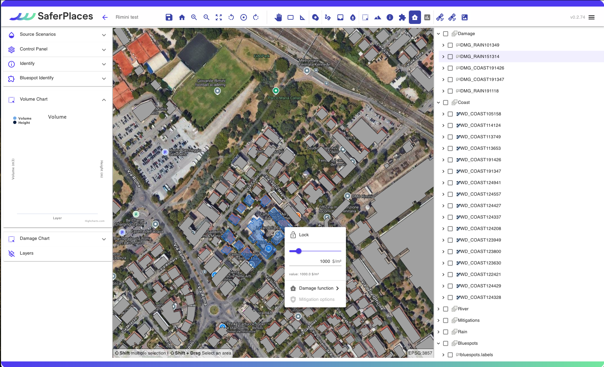
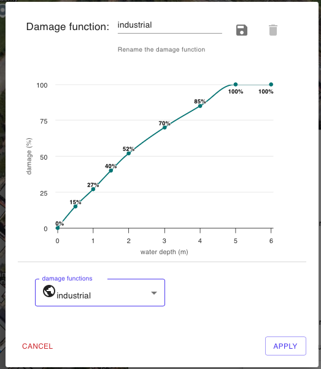
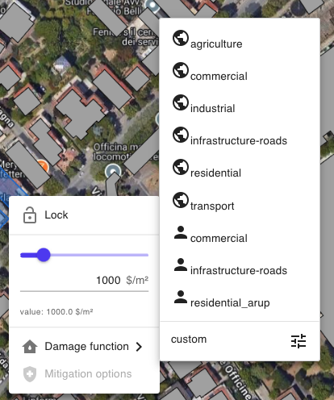

# Top bar

In the top bar, there are many tools available, as shown in the figure below and described in the table.

<figure><figcaption>
Strumenti della barra superiore
</figcaption></figure>

map navigation tools

In the top left, there are some basic tools, listed from left to right:

* button to save project progress,
* return to the last saved position,
* zoom in,
* zoom out,
* full screen,
* counter-clockwise rotation,
* reset rotations,
* clockwise rotation,
* panel to move around,
* zoom to select,
* ruler for measuring.

Specific Tools for Flood Simulation

* Tool called "Rain" to draw and locate a rainfall event in a sub-area within the domain [#definizione-e-caratterizzazione-dellevento-pluviale-pluvial-scenario-1-rain](../flood-and-damage-simulation/source-scenarios/pluvial-flood-simulation.md#definizione-e-caratterizzazione-dellevento-pluviale-pluvial-scenario-1-rain "mention") ( [pluvial-flood-simulation.md](../flood-and-damage-simulation/source-scenarios/pluvial-flood-simulation.md "mention"))
* strumento denominato _“Draw_ _Barrier”,_ per disegnare e localizzare barriere fisiche come azioni di mitogazione [#barriere-fisiche-3-barriers](../flood-and-damage-simulation/source-scenarios/coastal-flood-simulation.md#barriere-fisiche-3-barriers "mention") ( [flood-risk-mitigation-measures.md](../mitigation-measures/flood-risk-mitigation-measures.md "mention"))
* strumento denominato _“Draw storage tank”,_ per disegnare opzioni di mitigazione come una cisterna/serbatoio d'acqua ( [flood-risk-mitigation-measures.md](../mitigation-measures/flood-risk-mitigation-measures.md "mention"))
* strumento denominato _“Infiltration Rate”,_ per modificare il tasso di infiltrazione del terreno. ( [flood-risk-mitigation-measures.md](../mitigation-measures/flood-risk-mitigation-measures.md "mention"))

* Tool named "_Rain_" to design and locate a rainfall event in a sub-area within the domain.
* Tool named "_Draw Barrier_" to design and place physical barriers as mitigation actions.
* Tool named "_Draw storage tank_" to design mitigation options such as a water tank/reservoir.
* Tool named "_Infiltration Rate_" to modify the soil infiltration rate.

Tools for analyzing simulation results

In this group there are some tools for the analysis of the results generated by the simulations of algamento and calculation of economic damage.

A detailed description is present in [viewing-results.md](../output/viewing-results.md "mention")

* Volume/Damage  [#volume-chart-e-damage-chart](../output/viewing-results.md#volume-chart-e-damage-chart "mention")
* &#x20; [#section-sezione-trasversale](../output/viewing-results.md#section-sezione-trasversale "mention")
* &#x20; [#identify](../output/viewing-results.md#identify "mention")
* Analysis and water balance of [#bluespots](../output/viewing-results.md#bluespots "mention")

See the chapter on results ( [OUTPUT](https://app.gitbook.com/s/yCzOmis9aHsSuhV4IQow/output "mention")) for more information on the function of the individual instruments.

strumento Curve di Danno e Valore Edifici

In this group, the sturmento is activated that allows you to customize the economic value and vulnerability data of each building.\
\
Once the tool is activated, the layer of the buildings present in the Digital Twin is automatically visualized on the maps.\
\
By selecting one or more buildings (holding down the right mouse button you can draw a selection polygon), by clicking with the right mouse button the user activates a specific window where:

1. Change the value (euro/USD) per square meter of the selected buildings&#x20;
2. Assign a curve of damage or vulnerability of buildings. The Damage Function can be chosen from some available curves or generated based on user data and preferences.

Satellite data processing tools

Finally, the "Satellite" tool allows the user to activate 3 satellite functions:

* Safer 001
* Safer 002
* Safer 003

Please refer to the chapter with the description of the satellite tools for more information ( [Satellite Processing](https://app.gitbook.com/s/yCzOmis9aHsSuhV4IQow/satellite-processing "mention"))

